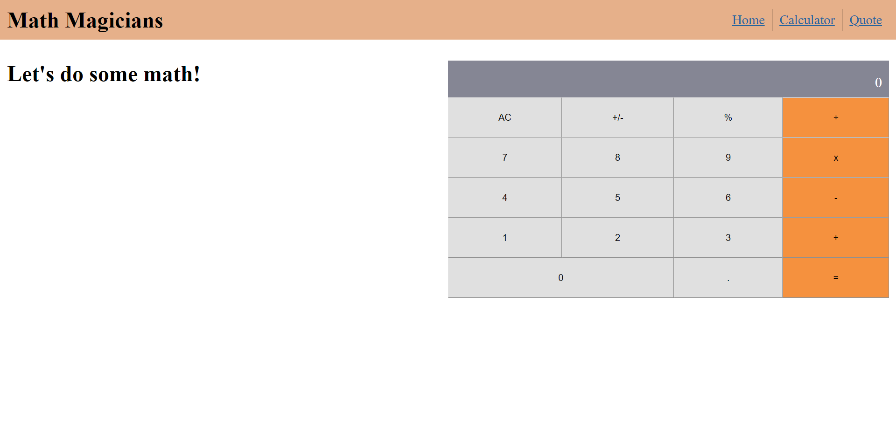

# Math-Magicians
> Math magicians is a website for all fans of mathematics. It is a Single Page App (SPA) that allows users to make simple calculations and also read random math-related quotes.

## Built With

- ReactJS

## Live demo

- GitHub Page [Math Magicians](https://zeenatlawal.github.io/Math-Magicians/)
- Heroku [Math Magicians](https://math-magicians-zee.herokuapp.com/)

## Getting Started

### To get a local copy run the following steps:

- Copy this link `https://github.com/ZeenatLawal/Math-Magicians.git`
- Open your terminal or command line
- Run `git clone` and paste the link
- Open the folder with your code editor
- Create a branch to work on
- Run `npm install`
- Run `npm start` to launch the server.
- Run `npm run test` to run the test cases.

## Author

👤 **Zeenat Lawal**

- GitHub: [@ZeenatLawal](https://github.com/ZeenatLawal)
- Twitter: [@lawal_zeenat](https://twitter.com/lawal_zeenat)
- LinkedIn: [Zeenat Lawal](https://www.linkedin.com/in/zeenatlawal/)

## 🤝 Contributing

Contributions, issues, and feature requests are welcome!

Feel free to check the [issues page](https://github.com/ZeenatLawal/Math-Magicians/issues).

## Show your support

Give a ⭐️ if you like this project!

## Acknowledgments

- Learning partners, Standup and morning session team
